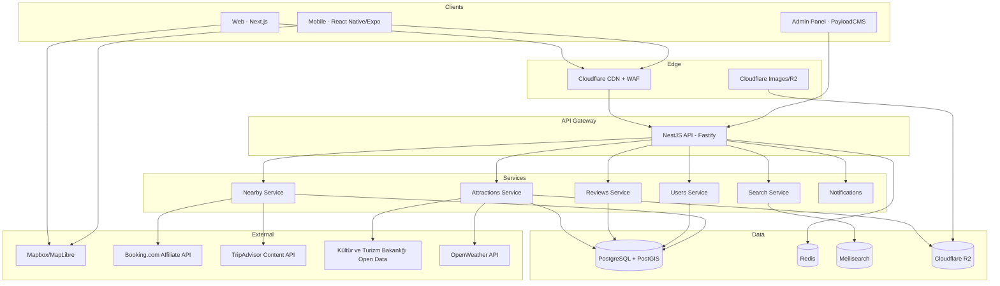

# 🇹🇷 Tourist Attractions in Türkiye — Production Roadmap

> A complete, phased execution plan from 0 → MVP → Production → Scale.
> Each phase is independently deployable, dependency-aware, and AI-agent executable.

---

## 1. APP OVERVIEW

### One-Sentence Description
A bilingual (Turkish/English) discovery platform that helps tourists and locals explore every notable tourist attraction in Türkiye with rich media, real-time logistics, reviews, and contextual recommendations for nearby hotels and restaurants.

### Target Users & Use Cases
| Segment | Use Cases |
|---------|-----------|
| **International Tourists** | Trip planning before/during travel, language barrier mitigation, finding nearby food/lodging, navigation in unfamiliar regions |
| **Domestic Turkish Travelers** | Discovering lesser-known regional attractions, weekend trip planning, regional culture exploration |
| **Travel Bloggers / Content Creators** | Sourcing high-quality information & photos, sharing curated lists |
| **Tour Operators (Phase 2+)** | B2B integration, lead generation, itinerary distribution |

### Core Value Proposition
> "Every Turkish attraction. One app. Two languages. Zero confusion."

A single source of truth that combines what `TripAdvisor`, `Google Maps`, `Booking.com`, and the Turkish Ministry of Culture & Tourism (`Kültür ve Turizm Bakanlığı`) provide separately — but designed for Türkiye-specific context.

### Success Metrics (MVP Stage)
- **Engagement:** ≥ 3 attractions viewed per session
- **Retention:** ≥ 25% D7 retention
- **Content Coverage:** ≥ 500 attractions across 81 provinces (`il`)
- **Performance:** LCP < 2.5s, TTI < 3.5s on 4G
- **Quality:** ≥ 4.2/5 average user rating
- **Accessibility:** WCAG 2.1 AA compliance
- **Internationalization:** 100% UI string coverage for TR + EN

---

## 2. RECOMMENDED TECH STACK

| Layer | Choice | Justification |
|-------|--------|---------------|
| **Web Frontend** | `Next.js 15` (App Router) + `React 19` + `TypeScript` | SSR/ISR critical for tourism SEO ("Cappadocia tours", "Hagia Sophia visit"); built-in i18n routing; React Server Components reduce JS bundle |
| **Mobile** | `React Native` + `Expo SDK 53` | Single codebase iOS/Android; OTA updates via EAS; shares TypeScript types & business logic with web; native maps performance |
| **Styling** | `Tailwind CSS v4` + `shadcn/ui` + `Radix Primitives` | Atomic CSS = small bundle; shadcn for accessible, themeable components; Radix handles a11y heavy lifting |
| **State** | `TanStack Query` (server state) + `Zustand` (client state) | Query handles caching/refetching; Zustand for lightweight UI state — avoid Redux boilerplate |
| **Backend** | `NestJS` + `Fastify` adapter + `TypeScript` | Modular DI architecture scales; Fastify ~2× faster than Express; same language as frontend = shared DTOs |
| **API Pattern** | `REST` (public) + `tRPC` (internal admin) + `OpenAPI 3.1` spec | REST for cacheability + 3rd-party consumption; tRPC for type-safe admin panel; OpenAPI auto-generates SDKs |
| **Database** | `PostgreSQL 16` + `PostGIS` extension | Geospatial queries (proximity, bounding box) are first-class; `JSONB` for flexible attraction metadata; mature ecosystem |
| **ORM** | `Prisma 5` | Type-safe queries; excellent migrations; supports PostGIS via raw SQL when needed |
| **Search** | `Meilisearch` (self-hosted) | Typo-tolerant; native multilingual (TR + EN with stemming); 10× cheaper than Algolia at scale; ms-level latency |
| **Cache** | `Redis 7` (Upstash serverless) | Session storage, rate limiting, hot-path caching; serverless model fits low-traffic MVP |
| **Auth** | `Clerk` (MVP) → `Auth.js` (self-hosted, post-PMF) | Clerk = fast launch with social login, MFA, fraud detection out-of-box; migrate to self-hosted later for cost & data sovereignty (KVKK) |
| **Object Storage** | `Cloudflare R2` | S3-compatible API; **zero egress fees** (critical for image-heavy app); paired with Cloudflare CDN |
| **CDN / Image Optimization** | `Cloudflare CDN` + `next/image` + `Cloudflare Images` | Auto WebP/AVIF; on-the-fly resizing; global PoPs include Istanbul + Frankfurt |
| **Maps** | `MapLibre GL JS` + `Mapbox` tiles (or `OpenFreeMap`) | Open-source rendering; `Mapbox` 50k loads/mo free; 5–10× cheaper than Google Maps for tourism scale |
| **Geocoding** | `Mapbox Geocoding` + fallback to `Nominatim` (OSM) | Mapbox better for Turkish addresses; OSM Nominatim for free fallback |
| **Hosting (Web)** | `Vercel` (frontend) + `Railway`/`Fly.io` (backend services) | Vercel optimal for Next.js; Railway/Fly = simple Postgres/Redis + low ops overhead |
| **Hosting (Mobile)** | `EAS Build` + `App Store` + `Google Play` | Managed Expo workflow; OTA updates avoid store reviews for non-native changes |
| **CI/CD** | `GitHub Actions` + `Turborepo` | Monorepo task pipelining; cached builds; native GitHub integration |
| **Observability** | `Sentry` (errors) + `PostHog` (product analytics + session replay) + `Better Stack` (uptime + logs) | Sentry for stack traces; PostHog OSS-friendly + funnels; Better Stack consolidates logs/uptime |
| **Email** | `Resend` | Modern API, React Email templates, fair pricing |
| **Push Notifications** | `Expo Push` (mobile) + `Web Push API` | Free tier sufficient at MVP; unified abstraction layer |
| **i18n** | `next-intl` (web) + `i18next` (mobile) + `Crowdin` (translation mgmt) | next-intl integrates with App Router; Crowdin for collaborative translation workflow |
| **Content Mgmt** | `PayloadCMS` (self-hosted, embedded) | Headless CMS with TypeScript-first API; admins can edit attraction content; localization built-in |
| **Testing** | `Vitest` + `Playwright` + `MSW` + `Detox` (mobile) | Vitest 5–10× faster than Jest; Playwright = robust e2e; Detox for RN |
| **Code Quality** | `Biome` + `TypeScript strict` + `Knip` | Biome = single tool replacing ESLint+Prettier (~25× faster); Knip finds dead code |
| **Secrets** | `Doppler` or `Vercel Env` + `1Password` for team | Centralized rotation; audit logs |
| **Error Budgets** | `SLO`-driven via Sentry + alerts to `Discord`/`Slack` | Engineering hygiene from day 1 |

### Tech Stack Risks Acknowledged
- **Clerk** lock-in → mitigated by abstracting auth behind own service interface from day 1.
- **Mapbox** pricing → keep `MapLibre` swap path open; cache tiles aggressively.
- **PayloadCMS** is younger than Strapi/Sanity → chosen for TypeScript fidelity; fallback plan: migrate to Sanity if instability emerges.

---

## 3. SYSTEM ARCHITECTURE

### High-Level Diagram (Mermaid)



### Data Model Overview

Core entities (simplified, full Prisma schema in Phase 1):

```typescript
// Attraction
{
  id: cuid
  slug: string (URL-safe, multilingual aware)
  category: enum[HISTORICAL, NATURAL, RELIGIOUS, CULTURAL, BEACH, MUSEUM, ...]
  region: string (Marmara, Aegean, ...)
  province: string (Istanbul, Izmir, ...)
  district: string?
  geom: PostGIS Point (4326 SRID)
  elevation_m: int?
  unesco_status: enum?
  translations: AttractionTranslation[] // TR, EN
  media: Media[]
  operatingHours: OperatingHours[]      // seasonal variations
  pricing: TicketPricing[]              // adult, student, child, foreigner
  accessibility: AccessibilityFlags
  visitorStats: VisitorStats[]          // monthly time series
  averageRating: float
  reviewCount: int
  createdAt, updatedAt
}

// AttractionTranslation
{ attractionId, locale: 'tr' | 'en', name, description, history, tips, slug }

// Review { id, userId, attractionId, rating 1-5, title, body, locale, photos[], helpful, status: PENDING|APPROVED|REJECTED }

// User { id, email, name, locale, avatar, role }

// Favorite { userId, attractionId, createdAt }

// Itinerary (Phase 8) { id, userId, title, days[], shareToken }

// NearbyPlace (cached) { attractionId, type: HOTEL|RESTAURANT, providerId, providerName, distance_m, rating, externalLink }
```

### API Design Approach
- **Public REST** under `/api/v1/*` — versioned, OpenAPI documented, public-cacheable via `Cache-Control` + Cloudflare.
- **Internal tRPC** under `/internal/*` — admin actions, uses session cookies, never exposed publicly.
- **GraphQL deliberately rejected** — REST + ISR caches better at edge; tourism queries are mostly read-heavy and predictable.
- **Pagination:** cursor-based for lists.
- **Rate limiting:** per-IP (anonymous: 60 req/min, authed: 600 req/min).
- **All responses include `Content-Language` header.**

### Folder Structure (Monorepo via Turborepo)

```
turkiye-tourism/
├── apps/
│   ├── web/                  # Next.js 15
│   ├── mobile/               # Expo/RN
│   ├── admin/                # PayloadCMS
│   └── api/                  # NestJS
├── packages/
│   ├── database/             # Prisma schema, migrations, seeds
│   ├── ui/                   # Shared shadcn/ui components
│   ├── types/                # Shared TS types & DTOs
│   ├── i18n/                 # Locale files, formatters
│   ├── config/               # Shared eslint/tsconfig/biome
│   └── utils/                # Shared utilities (geo, date, currency)
├── infrastructure/
│   ├── docker/
│   ├── terraform/            # Phase 9+
│   └── k8s/                  # Phase 12+
├── .github/workflows/
├── turbo.json
├── package.json (pnpm workspaces)
└── README.md
```

---

## 4. PHASE PLAN

# 🟢 MVP PHASES

---

### 📍 Phase 0: Foundation & Developer Infrastructure

**Objective:**
Establish a production-grade monorepo, CI/CD, and observability scaffold so that *every* feature commit ships safely from day 1.

**Dependencies:** None (this is the seed phase).

**Deliverables:**
- Turborepo monorepo with `apps/web`, `apps/api`, `packages/*` skeletons
- `pnpm` workspaces, locked Node version (`.nvmrc` → 22 LTS)
- GitHub repo with branch protection, signed commits, CODEOWNERS
- GitHub Actions: lint → typecheck → test → build matrix
- Sentry, PostHog, Better Stack accounts wired up
- Docker Compose for local dev (`postgres`, `redis`, `meilisearch`)
- Prisma schema initial migration applied
- KVKK + GDPR initial privacy policy draft
- `.env.example` for every app
- README with setup, conventions, contribution guide
- Vercel + Railway projects provisioned (staging + prod)

**Tech Decisions:**
- `pnpm@9`, `Node 22 LTS`, `Turborepo 2`
- `Biome` (replaces ESLint + Prettier)
- `commitlint` + `Conventional Commits` + `changesets`
- `husky` + `lint-staged` pre-commit hooks
- `Doppler` for secret distribution

**Tasks:**

**Infrastructure**
- [ ] Initialize monorepo: `pnpm dlx create-turbo@latest`
- [ ] Configure `turbo.json` pipelines (`build`, `lint`, `test`, `dev`)
- [ ] Add `.editorconfig`, `.nvmrc`, `biome.json`
- [ ] Set up Docker Compose for local services (Postgres 16 + PostGIS, Redis 7, Meilisearch)
- [ ] Provision Vercel projects for `web` (staging + prod)
- [ ] Provision Railway projects for `api`, `postgres`, `redis`, `meilisearch`
- [ ] Set up Doppler for secret management; integrate with Vercel + Railway
- [ ] Configure Cloudflare account, R2 bucket, CDN, WAF rules
- [ ] Configure DNS (apex + `staging.` subdomain)

**Backend Scaffolding**
- [ ] Initialize NestJS app with Fastify adapter
- [ ] Configure Prisma with `database/schema.prisma` + initial migration
- [ ] Add `helmet`, `cors`, `compression`, `csurf` (where needed) middleware
- [ ] Add OpenAPI Swagger setup → exposes `/docs` (gated in prod)
- [ ] Health check endpoints: `/healthz`, `/readyz`
- [ ] Structured logging via `pino`

**Frontend Scaffolding**
- [ ] Initialize Next.js 15 with App Router + TypeScript strict
- [ ] Configure Tailwind v4 + shadcn/ui CLI
- [ ] Configure `next-intl` with `tr` and `en` locales
- [ ] Add SEO defaults: sitemap.ts, robots.ts, OG image generator
- [ ] Add analytics SDKs (PostHog) — gated on cookie consent banner
- [ ] Configure `next/image` with Cloudflare loader

**CI/CD**
- [ ] `.github/workflows/ci.yml`: lint → typecheck → test → build
- [ ] `.github/workflows/preview.yml`: Vercel preview deploys per PR
- [ ] `.github/workflows/release.yml`: tag-driven prod deploy with smoke tests
- [ ] Add `dependabot.yml` (weekly, grouped)
- [ ] Add `CodeQL` scanning

**Observability**
- [ ] Sentry projects for `web`, `api`, `mobile` (later)
- [ ] PostHog project + feature flags namespace
- [ ] Better Stack uptime monitor for `/healthz`
- [ ] Define initial SLOs: API p95 < 300ms, web LCP < 2.5s

**Testing Foundations**
- [ ] Vitest config for backend + frontend
- [ ] Playwright config + first smoke test (`homepage loads`)
- [ ] MSW handlers scaffold

**Critical Considerations:**
- **Security:** All secrets via Doppler — never `.env` in repo. Helmet headers strict CSP from day 1. WAF blocks Türkiye-relevant bot signatures.
- **Performance:** Turborepo remote caching enabled to keep CI < 5 min.
- **Edge Cases:** Local dev must work offline (no cloud dependencies for `pnpm dev`).
- **UX (DX):** New developer onboarding < 30 minutes from `git clone` to running app.
- **Legal:** KVKK Aydınlatma Metni + GDPR notice published before any user data is collected.

**Execution Prompt (for AI Agent):**

> You are setting up a production-grade TypeScript monorepo for a Turkish tourism web + mobile app. Create a Turborepo monorepo using pnpm workspaces with the following exact structure: `apps/web` (Next.js 15 App Router, TypeScript strict, Tailwind v4, shadcn/ui, next-intl with locales tr/en), `apps/api` (NestJS with Fastify adapter, Prisma 5, pino logging, Swagger at /docs), `packages/database` (Prisma schema and migrations targeting PostgreSQL 16 with PostGIS extension), `packages/ui` (shared React component library), `packages/types`, `packages/i18n`, `packages/config` (shared Biome, tsconfig). Use Biome for linting/formatting (not ESLint/Prettier). Configure Vitest for unit tests and Playwright for e2e. Add a `docker-compose.yml` at the root that starts `postgres:16-3.4-alpine` (with PostGIS), `redis:7-alpine`, and `getmeili/meilisearch:latest`. Add GitHub Actions workflows: `ci.yml` (lint, typecheck, test, build matrix), `preview.yml` (Vercel preview deploys), and `release.yml`. Add husky + lint-staged pre-commit hooks running biome check + typecheck on staged files. Include a `.env.example` for every app, a comprehensive README with setup steps, and conventional commits config via commitlint. The setup must be runnable with `pnpm install && pnpm dev` after copying `.env.example` to `.env`. Acceptance: `pnpm lint`, `pnpm typecheck`, `pnpm test`, `pnpm build` all pass. CI completes in under 5 minutes. New developer reaches running app in < 30 minutes. Do not implement any feature code yet — only scaffolding, infrastructure, and a single placeholder homepage with `Hello from Türkiye`/`Merhaba Türkiye'den` based on locale.

---

### 📍 Phase 1: Core Attraction Catalog (Backend & Data Foundation)

**Objective:**
Build the authoritative attraction database and read API capable of serving 500+ attractions with multilingual content, geospatial queries, and admin CMS.

**Dependencies:** Phase 0.

**Deliverables:**
- Complete Prisma schema for `Attraction`, `AttractionTranslation`, `Media`, `OperatingHours`, `TicketPricing`, `Category`, `Region`, `Province`
- REST endpoints: `GET /api/v1/attractions`, `GET /api/v1/attractions/:slug`, `GET /api/v1/attractions/nearby`, `GET /api/v1/categories`, `GET /api/v1/provinces`
- PayloadCMS admin panel for content editors
- Seed data: 50 highest-priority attractions (Hagia Sophia, Cappadocia balloons, Pamukkale, Ephesus, Topkapı, Sumela Monastery, etc.)
- Image upload pipeline: R2 + Cloudflare Images variants
- Geospatial queries via PostGIS (`ST_DWithin` for radius search)
- OpenAPI spec auto-generated and published

**Tech Decisions:**
- `Prisma 5` with `previewFeatures = ["postgresqlExtensions"]`
- Slug strategy: per-locale slugs (`/en/attractions/hagia-sophia`, `/tr/gezi-yerleri/ayasofya`)
- Image variants: `thumb` (200×200), `card` (400×300), `hero` (1600×900), `gallery` (1200×800)
- Media metadata: photographer credit, license, alt text per locale

**Tasks:**

**Backend / API**
- [ ] Define Prisma schema with PostGIS `geom` column via `@db.Geometry("Point", 4326)`
- [ ] Create migration with raw SQL: `CREATE EXTENSION postgis;` + GIST indexes on `geom`
- [ ] Build `AttractionsModule` with controller, service, DTOs, validation (`class-validator`)
- [ ] Build `MediaModule` with R2 presigned upload URL endpoint
- [ ] Implement `GET /attractions` with filters: `category`, `region`, `province`, `q`, `bbox`, `near` (lat,lng,radius)
- [ ] Implement `GET /attractions/:slug` returning localized content based on `Accept-Language`
- [ ] Implement `GET /attractions/nearby?lat&lng&radius` using PostGIS `ST_DWithin`
- [ ] Add response caching: `Cache-Control: public, s-maxage=3600, stale-while-revalidate=86400`
- [ ] Add ETag support for conditional requests
- [ ] Generate and publish OpenAPI 3.1 spec at `/api/v1/openapi.json`

**Admin / CMS**
- [ ] Set up PayloadCMS in `apps/admin` connected to same Postgres
- [ ] Configure collections: `Attractions`, `Media`, `Categories`, `Translations`
- [ ] Configure localization (TR + EN) at field level
- [ ] Add role-based access: `editor`, `reviewer`, `admin`
- [ ] Add image upload integrated with R2
- [ ] Add map picker for setting attraction coordinates (Leaflet plugin)
- [ ] Add audit log for content changes

**Data Seeding**
- [ ] Compile authoritative source list: Kültür ve Turizm Bakanlığı open data, UNESCO list, Wikipedia, official tourism site
- [ ] Manually verify and seed 50 attractions with TR + EN content
- [ ] Source images with proper licensing (Wikimedia Commons CC-BY-SA, official press kits, original photography)
- [ ] Document `data-attribution.md` for every photo

**Infrastructure**
- [ ] Configure R2 lifecycle policy (cold archive after 90d for unused variants)
- [ ] Set up Cloudflare Images for on-the-fly variants
- [ ] Add database backups: daily logical (`pg_dump`) → R2; PITR via Railway
- [ ] Set up DB read replica config (off by default, ready for Phase 5+)

**Testing**
- [ ] Unit tests for `AttractionsService` (filters, geospatial logic)
- [ ] Integration tests with test Postgres (Docker) covering all endpoints
- [ ] Contract tests against OpenAPI spec
- [ ] Load test: 1000 RPS on `GET /attractions` with k6 — p95 < 200ms

**Critical Considerations:**
- **Security:** Rate-limit unauthenticated reads to 60/min/IP. Sanitize search input (no SQL injection via filters). Validate all UGC-style fields (description, tips) via DOMPurify on output.
- **Performance:** Index `geom` (GIST), `slug` (per-locale unique), `category_id`, `province_id`. Use Postgres `EXPLAIN ANALYZE` to validate query plans.
- **Edge Cases:** Attractions without exact coordinates (e.g., "Lake Van" — use centroid). Seasonal closures (Mt. Nemrut closed in winter). Multiple historical names ("Constantinople" → "Istanbul").
- **UX:** Editors should preview localized content side-by-side. Image alt text required in both locales (a11y).
- **Legal:** Every photo metadata includes license + attribution. KVKK: no PII stored at this phase. Wikimedia attribution generated automatically.

**Execution Prompt (for AI Agent):**

> Implement the core attraction catalog for the Türkiye tourism platform. Working in the existing Turborepo monorepo, do the following: (1) In `packages/database`, define Prisma schema with these models: `Attraction` (id, slug, categoryId, regionId, provinceId, district, latitude, longitude, geom Point 4326, elevationM, unescoStatus enum, averageRating, reviewCount, status enum DRAFT|PUBLISHED, createdAt, updatedAt), `AttractionTranslation` (attractionId, locale enum tr|en, name, slug, summary, description, history, tips, unique on attractionId+locale and locale+slug), `Media` (id, attractionId, url, variants JSONB, type IMAGE|VIDEO, alt JSONB by locale, photographer, license, sortOrder), `OperatingHours` (attractionId, season enum, dayOfWeek 0-6, openTime, closeTime, isClosed bool), `TicketPricing` (attractionId, audience enum ADULT|STUDENT|CHILD|SENIOR|FOREIGN_ADULT|FOREIGN_STUDENT, priceTry decimal, isFree bool, validFrom, validTo), `Category` (id, slug, nameTranslations JSONB), `Region` (id, name e.g. Marmara), `Province` (id, name, regionId). Add a Prisma migration that creates the postgis extension and a GIST index on Attraction.geom. (2) In `apps/api`, create `AttractionsModule` with REST endpoints: `GET /api/v1/attractions` supporting query params `category`, `region`, `province`, `q` (Turkish-aware search), `bbox=minLng,minLat,maxLng,maxLat`, `near=lat,lng,radius`, `limit` (default 20, max 100), `cursor` (cursor pagination); `GET /api/v1/attractions/:slug` resolving by locale-aware slug from Accept-Language header (default tr); `GET /api/v1/attractions/nearby` using PostGIS ST_DWithin; `GET /api/v1/categories`; `GET /api/v1/provinces`. All list endpoints return `Cache-Control: public, s-maxage=3600, stale-while-revalidate=86400` and ETag. Use class-validator DTOs with strict whitelist. Implement structured pino logging with correlation IDs. (3) Set up PayloadCMS in `apps/admin` connected to the same database, with collections matching the Prisma models, field-level localization for TR/EN, a Leaflet map field for picking coordinates, and image uploads to Cloudflare R2 (use S3-compatible SDK). Configure roles: editor, reviewer, admin. (4) Write a seed script `packages/database/seed.ts` that inserts 5 hand-curated attractions (Ayasofya, Kapadokya, Pamukkale, Efes, Topkapı Sarayı) with full TR+EN translations, real coordinates, opening hours, and pricing. Include public-domain placeholder images from Wikimedia Commons with proper attribution metadata. (5) Write Vitest integration tests covering all endpoints using a Postgres test container, and a k6 load test script. (6) Generate OpenAPI 3.1 spec via NestJS Swagger module exposed at `/api/v1/openapi.json`. Acceptance: all tests pass, `GET /api/v1/attractions` p95 < 200ms at 1000 RPS local k6, OpenAPI spec validates, admin panel can create/edit/publish an attraction with bilingual content and an image. Do not implement reviews, users, or frontend display in this phase.

---

### 📍 Phase 2: Web Discovery Experience (Frontend MVP)

**Objective:**
Ship a production-quality, SEO-optimized web app where users can browse, search, and view attractions in Turkish or English with rich media and maps.

**Dependencies:** Phase 1.

**Deliverables:**
- Localized routes: `/{locale}/attractions`, `/{locale}/attractions/{slug}`, `/{locale}/regions/{region}`, `/{locale}/categories/{category}`
- Homepage with featured attractions, regions grid, popular categories
- Attraction detail page: hero gallery, description, history, tips, opening hours, pricing, map, share buttons
- Search bar with autosuggest (powered by Phase 4 — placeholder via DB ILIKE for now)
- Map view with clustering (MapLibre + supercluster)
- Language switcher with locale persistence
- Mobile-responsive design (320px → 4K)
- Lighthouse score ≥ 90 across the board
- Sitemap with `hreflang` tags for both locales

**Tech Decisions:**
- Next.js 15 App Router with `[locale]` segment
- ISR for attraction pages (`revalidate: 3600`)
- `next-intl` for translations + formatters (numbers, dates, currency)
- MapLibre GL JS + supercluster for client-side clustering
- `next/image` with R2 remote pattern + Cloudflare loader
- `next-seo` for structured data (`Place`, `TouristAttraction` JSON-LD)

**Tasks:**

**Frontend**
- [ ] Set up `[locale]` dynamic segment with `tr` (default) and `en`
- [ ] Implement middleware for locale detection (cookie → header → fallback `tr`)
- [ ] Build shared layout: header (logo, search, locale switcher, nav), footer
- [ ] Build homepage: hero, search, featured grid, region map, categories
- [ ] Build `/attractions` listing page: filters sidebar, sort, paginated grid
- [ ] Build `/attractions/[slug]` detail page:
  - Hero image gallery (`react-photo-album` + `yet-another-react-lightbox`)
  - Title + breadcrumbs + share buttons
  - Description sections (overview, history, visitor tips)
  - Opening hours table with seasonal toggle
  - Pricing table with currency switcher (TRY/USD/EUR)
  - Embedded MapLibre map with attraction marker + nearby attractions
  - Operating status badge (Open Now / Closed / Seasonal)
  - "Get Directions" deep links (Google Maps, Apple Maps, Yandex)
- [ ] Build `/regions/[region]` and `/categories/[category]` pages
- [ ] Add JSON-LD structured data (`TouristAttraction`, `BreadcrumbList`, `ImageObject`)
- [ ] Add OG image generation per attraction (`@vercel/og`)
- [ ] Add `sitemap.ts` generating per-locale URLs with `hreflang` alternates
- [ ] Add `robots.ts` allowing crawlers, blocking admin

**Internationalization**
- [ ] Set up `next-intl` provider + middleware
- [ ] Create translation files: `messages/tr.json`, `messages/en.json`
- [ ] Implement language switcher that preserves current path (locale-aware slug mapping)
- [ ] Add date/number/currency formatters per locale
- [ ] Test RTL safety (future-proofing for Arabic Phase 13+)

**Performance**
- [ ] Configure Next.js image optimization with R2/Cloudflare loader
- [ ] Use `loading="lazy"` for below-fold images, priority for LCP
- [ ] Code-split MapLibre via `next/dynamic` (deferred until visible)
- [ ] Measure: LCP < 2.5s, INP < 200ms, CLS < 0.1
- [ ] Run Lighthouse CI on every PR

**Accessibility**
- [ ] All interactive elements keyboard-navigable
- [ ] Alt text from CMS rendered correctly per locale
- [ ] Focus states visible (Tailwind `focus-visible:`)
- [ ] Run axe-core in CI; fail PR on a11y regression
- [ ] Color contrast ≥ AA

**SEO**
- [ ] Per-page `<title>` and `<meta description>` from translations
- [ ] Canonical URLs
- [ ] hreflang for all content pages
- [ ] Open Graph + Twitter Cards
- [ ] Structured data validated with Google Rich Results Test

**Testing**
- [ ] Component tests for critical UI (search, gallery, map embed)
- [ ] Playwright e2e: homepage → category → attraction → switch language flow
- [ ] Visual regression via Playwright screenshots
- [ ] Lighthouse CI minimum: Performance 90, A11y 95, SEO 95, Best Practices 95

**Critical Considerations:**
- **Security:** No client-side secrets. CSP strict with allowlisted domains (R2, Mapbox tiles, PostHog). Sanitize HTML in description fields server-side.
- **Performance:** Map tiles cached aggressively. Hero images served as AVIF/WebP. Text-only content under 100KB.
- **Edge Cases:** Missing translations fall back gracefully (show TR content with `[EN translation pending]` flag). Attractions without images show categorized placeholder. Slow connections degrade gracefully.
- **UX:** Currency conversion shown but original TRY is canonical. Operating-hours respect Türkiye timezone (`Europe/Istanbul`).
- **Legal:** Photo attribution visible in gallery. Cookie consent banner before any non-essential cookies. KVKK-compliant footer with policies.

**Execution Prompt (for AI Agent):**

> Build the Türkiye tourism web frontend MVP in `apps/web` using Next.js 15 App Router, TypeScript strict mode, Tailwind CSS v4, shadcn/ui, and next-intl. The API at `apps/api` is already implemented. (1) Configure `[locale]` dynamic route segment supporting `tr` (default) and `en` with next-intl middleware that detects locale from cookie, then Accept-Language header, then falls back to `tr`. (2) Create the following routes under `app/[locale]/`: `page.tsx` (homepage with hero, search bar, 8 featured attractions, region grid, categories), `attractions/page.tsx` (listing with filters: category, region, province, sort by rating/popular/recent), `attractions/[slug]/page.tsx` (detail page with hero gallery using `react-photo-album`+`yet-another-react-lightbox`, sticky info card with status badge, opening hours table, pricing table with TRY/USD/EUR switcher using current FX rates from a daily-cached endpoint, embedded MapLibre map showing attraction + 5 nearby, share buttons), `regions/[region]/page.tsx`, `categories/[category]/page.tsx`. (3) Use ISR `export const revalidate = 3600` for detail pages and `force-static` with `generateStaticParams` where feasible. (4) Add JSON-LD structured data (`TouristAttraction`, `Place`, `BreadcrumbList`, `ImageObject`) and generate per-attraction Open Graph images via `@vercel/og`. (5) Implement `sitemap.ts` and `robots.ts` with proper `hreflang` alternates for both locales. (6) Build a language switcher in the header that preserves the user's location across locales by mapping slugs through the API. (7) Use shadcn/ui components for buttons, cards, dialogs, dropdowns, tables. Use MapLibre GL JS with supercluster for clustering, code-split via `next/dynamic` with `ssr: false`. Configure `next/image` with R2 remote patterns. (8) Translation files in `apps/web/messages/{tr,en}.json` covering all UI strings. Provide formatters for dates, numbers, currency, distances. (9) Add Playwright e2e tests covering: homepage loads under 2.5s LCP, search returns results, attraction detail page renders gallery + map + pricing, language switcher works without losing context. (10) Add Lighthouse CI threshold gates: Performance ≥ 90, Accessibility ≥ 95, SEO ≥ 95, Best Practices ≥ 95. (11) Configure CSP in `next.config.ts` with strict allowlist. Acceptance: all e2e tests pass, Lighthouse thresholds met on staging, both locales fully functional, axe-core reports zero violations, sitemap valid. Do not implement reviews, user accounts, favorites, or itineraries — those are later phases.

---

### 📍 Phase 3: Search & Discovery (Meilisearch Integration)

**Objective:**
Replace placeholder DB-based search with fast, typo-tolerant, multilingual search supporting both Turkish (with diacritic-insensitivity) and English.

**Dependencies:** Phase 1, Phase 2.

**Deliverables:**
- Meilisearch deployed in production
- Indexer service syncing Postgres → Meilisearch on writes (event-driven)
- Per-locale indexes: `attractions_tr`, `attractions_en`
- Search API endpoint: `GET /api/v1/search?q=&locale=&filters=`
- Frontend: instant search with autosuggest, recent searches, popular searches
- Faceted search (category, region, has free entry, etc.)

**Tech Decisions:**
- `Meilisearch v1.10` (self-hosted on Railway)
- Synonyms: `Ayasofya ↔ Hagia Sophia`, `Pamukkale ↔ Cotton Castle`, `Cappadocia ↔ Kapadokya`
- Stop words per locale
- Typo tolerance: 1 typo for 5+ chars, 2 typos for 9+ chars

**Tasks:**

**Backend**
- [ ] Deploy Meilisearch instance with persistent volume
- [ ] Create `SearchModule` in NestJS
- [ ] Define index settings per locale (searchable, filterable, sortable, ranking rules)
- [ ] Implement Postgres CDC via Prisma middleware → enqueue index job
- [ ] Build worker (`BullMQ` + Redis) to process index updates
- [ ] Implement bulk reindex command (`pnpm api:reindex`)
- [ ] Implement `GET /api/v1/search`:
  - Query, locale, filters (category, region, hasFree, isUnesco)
  - Returns hits + facets + estimatedTotalHits
- [ ] Implement search analytics: log queries → PostHog
- [ ] Add Turkish diacritic normalization (`Türkçe` ≈ `Turkce`)

**Frontend**
- [ ] Build `<SearchBar>` with debounced input + dropdown
- [ ] Show categories, attractions, regions in autosuggest
- [ ] Build `/{locale}/search?q=` results page with facets
- [ ] Persist recent searches in localStorage
- [ ] Show "Popular searches" from PostHog top queries
- [ ] Keyboard navigation (↑↓ Enter Esc)
- [ ] Highlight matches in results

**Testing**
- [ ] Unit tests for index sync logic
- [ ] E2E: search "ayasofya" returns Hagia Sophia in EN locale
- [ ] E2E: typo "kapadoya" returns Kapadokya
- [ ] Performance: search p95 < 50ms

**Critical Considerations:**
- **Security:** Public search uses scoped API key (search-only). Admin operations use master key (server-only).
- **Performance:** Search must be < 50ms p95. Use facet caching for static facets.
- **Edge Cases:** Empty query → trending. Very long queries → truncated. SQL-like injection attempts → sanitized.
- **UX:** Clear "no results" with suggestions ("Did you mean X?"). Searches log to analytics for content gap detection.
- **Legal:** Search query logging anonymous; respect Do Not Track.

**Execution Prompt (for AI Agent):**

> Replace the placeholder DB search with Meilisearch in the Türkiye tourism monorepo. (1) Add Meilisearch service to `docker-compose.yml` and provision an instance on Railway with persistent volume. Configure master and search-only API keys in Doppler. (2) In `apps/api`, create `SearchModule` with: a Meilisearch client wrapper, index definitions for `attractions_tr` and `attractions_en` with configured `searchableAttributes` (name, summary, description, history, province, district, categoryName), `filterableAttributes` (categoryId, regionId, provinceId, hasFreeEntry, isUnesco, averageRating), `sortableAttributes` (averageRating, reviewCount, popularityScore), `rankingRules`, locale-specific stop words and synonyms (e.g. `["Ayasofya", "Hagia Sophia"]`, `["Kapadokya", "Cappadocia"]`, `["Pamukkale", "Cotton Castle"]`). (3) Implement event-driven sync via Prisma middleware → BullMQ job queue (Redis-backed). On Attraction or Translation create/update/delete, enqueue an index sync job. The worker pulls fresh data from DB and updates both locale indexes idempotently. (4) Implement a bulk reindex CLI command `pnpm api:reindex`. (5) Build `GET /api/v1/search` with params `q`, `locale`, `filters` (e.g. `categoryId=...&hasFreeEntry=true`), `sort`, `limit`, `offset`. Response: hits with highlighted matches, facetDistribution, estimatedTotalHits, processingTimeMs. Use the search-only API key. (6) Log all search queries to PostHog with anonymized session IDs (no PII). (7) In `apps/web`, build a `<SearchBar>` component with 200ms debounced input, dropdown showing top 5 attractions + 3 categories + 2 regions, keyboard navigation, recent searches stored in localStorage. (8) Build `/[locale]/search?q=` page with full results, faceted filters (category, region, free entry, UNESCO), and infinite scroll. Show "Did you mean X?" suggestions when results are sparse. (9) Add Turkish-specific normalization so that `ayasofya`, `Ayasofya`, and `AYASOFYA` all match, and so that diacritic-stripped queries (`gobekli tepe`) match (`Göbekli Tepe`). (10) Tests: Vitest unit tests for the index sync, Playwright e2e for typo-tolerant search ("kapadoya" → Kapadokya), search-locale isolation (searching in `en` doesn't return Turkish-only content), and p95 < 50ms via k6. Acceptance: search returns relevant results with typos and synonyms in both locales, < 50ms p95, queries are indexed in real time on content change.

---

### 📍 Phase 4: Reviews, Ratings & Photos (Read-Path Trust Signals)

**Objective:**
Add user-generated reviews, ratings, and photo uploads to build trust and social proof — but keep moderation safe and KVKK-compliant.

**Dependencies:** Phase 1, Phase 2, Phase 5 (basic auth) — *or*, alternatively, ship Phase 5 first; choose ordering at planning time.

**Deliverables:**
- `Review` table + endpoints (CRUD with approval flow)
- Star rating widget on attraction detail page
- Review submission form (auth-required)
- Review list with sorting (recent, helpful, highest, lowest)
- Photo upload from review form
- Moderation queue in admin
- "Helpful" / "Report" actions
- Profanity + spam filtering (auto-hold)

**Tech Decisions:**
- Auto-moderation: `OpenAI moderation` API (or self-hosted `Perspective API` alternative) at submission
- Manual moderation: PayloadCMS queue
- Photos: limit 5 per review, max 10MB each, EXIF stripped server-side
- Ratings recomputed on review approval (cached on Attraction model)

**Tasks:**

**Backend**
- [ ] Prisma schema: `Review` (id, attractionId, userId, rating 1-5, title, body, locale, helpfulCount, status enum, createdAt)
- [ ] Prisma schema: `ReviewMedia`, `ReviewReaction` (helpful/report)
- [ ] `ReviewsModule` with endpoints:
  - `POST /api/v1/attractions/:slug/reviews` (auth required)
  - `GET /api/v1/attractions/:slug/reviews?sort=&page=`
  - `POST /api/v1/reviews/:id/helpful` / `/report`
  - `DELETE /api/v1/reviews/:id` (own only)
- [ ] Auto-moderation pipeline:
  - Profanity filter (per-locale wordlist + ML moderation)
  - Spam detection (link count, repeat content, account age)
  - Status set to `PENDING` if any flag triggers
- [ ] Trigger to recompute `Attraction.averageRating` and `reviewCount` on approval
- [ ] Image upload with EXIF stripping (`sharp` library)
- [ ] Rate limit: 5 reviews per user per day, 1 review per attraction per user

**Admin**
- [ ] Moderation queue view in PayloadCMS
- [ ] Bulk approve/reject actions
- [ ] Reviewer notes field
- [ ] Auto-notify reviewer via email (Resend)

**Frontend**
- [ ] Star rating component with half-stars
- [ ] Reviews section on attraction detail page
- [ ] Review form modal with photo upload + character counter
- [ ] Sort selector + pagination
- [ ] "Helpful" toggle (debounced API)
- [ ] "Report" dialog with reason dropdown
- [ ] Login prompt if unauthenticated user clicks "Write a review"

**Testing**
- [ ] Unit tests for moderation logic
- [ ] E2E: submit review → pending → approve in admin → visible on site
- [ ] E2E: submit review with profanity → auto-held
- [ ] Load test: 100 concurrent review submissions

**Critical Considerations:**
- **Security:** XSS protection on review content (server-side sanitization). Photos virus-scanned via `ClamAV` (or Cloudflare scan). Review API has CSRF token. Block reviews from disposable email domains.
- **Performance:** Review list paginated; aggregate fields cached on attraction record.
- **Edge Cases:** User deletes account → reviews show "Anonymous Visitor". Review on now-archived attraction → reviewer notified.
- **UX:** Mobile-first form (large stars, friendly photo picker). Save draft to localStorage. Show character count.
- **Legal:** **KVKK compliance critical**: Aydınlatma metni shown before submission. User can request deletion (Right to be Forgotten) — soft delete pattern. Photos require user confirmation of ownership/no-PII.

**Execution Prompt (for AI Agent):**

> Implement reviews, ratings, and photo uploads for the Türkiye tourism platform. Auth (Phase 5) is already implemented — use the `@CurrentUser()` decorator. (1) Add Prisma models: `Review` (id, attractionId fk, userId fk, rating Int 1-5 with check constraint, title String?, body String, locale enum, helpfulCount Int default 0, status enum PENDING|APPROVED|REJECTED|HIDDEN, autoModerationFlags JSONB, createdAt, updatedAt, unique on attractionId+userId for one-review-per-attraction-per-user), `ReviewMedia` (id, reviewId, url, variants JSONB, sortOrder), `ReviewReaction` (userId, reviewId, type enum HELPFUL|REPORT, reason String?). (2) Build `ReviewsModule` with endpoints: `POST /api/v1/attractions/:slug/reviews` (authenticated, body: rating, title, body, mediaIds[]), `GET /api/v1/attractions/:slug/reviews?sort=recent|helpful|rating_high|rating_low&page=&limit=` (returns approved only by default), `POST /api/v1/reviews/:id/helpful` (idempotent toggle), `POST /api/v1/reviews/:id/report` (with reason), `DELETE /api/v1/reviews/:id` (own reviews only, soft delete), `GET /api/v1/me/reviews` (own reviews including pending). (3) Implement auto-moderation pipeline that runs on review create: (a) profanity filter with per-locale wordlists in `packages/utils/profanity/{tr,en}.ts`, (b) spam heuristics: ≥ 2 URLs, body length < 20 chars, account age < 1 hour, repeat content from same user across attractions, (c) call OpenAI Moderation API for hate/harassment/sexual scoring; if any flag triggers, set status=PENDING and add reasons to autoModerationFlags JSONB. Otherwise set status=APPROVED. (4) On status change to APPROVED or away from APPROVED, fire a transactional update recomputing Attraction.averageRating and reviewCount. (5) Implement photo upload via presigned R2 URLs: client uploads up to 5 images, max 10MB each, JPEG/PNG/WebP only; backend post-processing strips EXIF using sharp, generates 3 variants (thumb, medium, full). (6) Rate limit: 5 reviews per user per 24h via Redis sliding window. (7) In PayloadCMS admin, add a Moderation Queue dashboard listing PENDING reviews with bulk approve/reject and reviewer notes; on reject, send email via Resend explaining the reason in the user's locale. (8) In `apps/web`, on attraction detail page add a Reviews section with: average rating display with rating distribution histogram, sort dropdown, paginated review cards with author display name (or "Anonymous Visitor" if account deleted), photo thumbnails opening lightbox, helpful/report buttons, and a "Write a review" button that opens a modal (or redirects to login if unauthed). The review form has: 1-5 star input with hover preview, title (optional, max 100 chars), body (required, 20-2000 chars with live counter), photo uploader (drag-drop, paste, or file picker, max 5), language indicator auto-set to current UI locale, KVKK consent checkbox (required) with link to privacy policy. Save form state to localStorage as draft. After submission show "Review pending moderation, you'll be notified by email" message. (9) Tests: Vitest unit tests for moderation pipeline (profanity catches, spam catches, clean passes), Playwright e2e covering full submit→moderate→display flow. Acceptance: clean reviews appear immediately, flagged reviews go to moderation queue, average rating updates correctly, photos have EXIF stripped, KVKK consent enforced, all interactions work in TR and EN.

---

### 📍 Phase 5: User Accounts, Auth & Favorites

**Objective:**
Allow users to sign up, manage profiles, save favorite attractions, and personalize their experience while remaining KVKK + GDPR compliant.

**Dependencies:** Phase 1, Phase 2.

**Deliverables:**
- Auth flows: email/password, Google, Apple sign-in
- User profile (avatar, name, language preference)
- Favorites (save attractions, view list)
- Email verification + password reset
- KVKK / GDPR data export & account deletion endpoints
- Session management with refresh tokens

**Tech Decisions:**
- `Clerk` for MVP (drop-in, KVKK can be questioned later)
- Alternative if Clerk rejected for sovereignty: `Auth.js` self-hosted with Postgres adapter + `@simplewebauthn/server` for passkeys
- Cookies: `httpOnly`, `secure`, `sameSite=lax`, signed
- CSRF token on mutating endpoints

**Tasks:**

**Backend**
- [ ] Integrate Clerk (or Auth.js) — gate behind `AuthService` interface for portability
- [ ] Prisma schema: `User` (id, clerkId, email, name, avatarUrl, locale, createdAt, deletedAt)
- [ ] Prisma schema: `Favorite` (userId, attractionId, createdAt)
- [ ] Webhook from Clerk → upsert User on signup/update
- [ ] Endpoints: `GET /api/v1/me`, `PATCH /api/v1/me`, `DELETE /api/v1/me` (account deletion), `GET /api/v1/me/export` (GDPR data export as JSON)
- [ ] `POST /api/v1/me/favorites/:attractionId`, `DELETE`, `GET /api/v1/me/favorites`
- [ ] `@CurrentUser()` and `@Auth()` decorators
- [ ] Session validation middleware

**Frontend**
- [ ] Auth pages: `/sign-in`, `/sign-up`, `/forgot-password`, `/verify-email` (use Clerk components or build from primitives)
- [ ] User dropdown in header (avatar, name, profile, favorites, logout)
- [ ] Profile page: edit name, avatar, language, delete account button
- [ ] Favorites page: grid of saved attractions
- [ ] "Heart" button on attraction cards/details (auth-gated)
- [ ] Locale persistence: when authed, save to user; otherwise cookie

**Privacy**
- [ ] Account deletion soft-deletes user, anonymizes reviews ("Anonymous Visitor"), removes favorites within 30 days
- [ ] Data export returns JSON of all user-owned data
- [ ] Consent recorded with timestamp + IP + version
- [ ] Privacy policy + Terms in TR + EN

**Testing**
- [ ] E2E: signup → verify email → login → favorite → view favorites → logout
- [ ] E2E: delete account → review becomes anonymous → favorites gone
- [ ] Security tests: CSRF protection, brute-force lockout, session invalidation on password change

**Critical Considerations:**
- **Security:** Password storage handled by Clerk (Argon2id). Brute force throttling via Cloudflare Turnstile. JWT short-lived (15 min) + refresh token rotation. Logout invalidates session server-side.
- **Performance:** Favorites lookups use composite index `(userId, attractionId)`. User row cached in Redis on auth.
- **Edge Cases:** Account merge on social login when emails match. Email change requires re-verification. Deleted accounts cannot be re-registered for 90 days (hold period).
- **UX:** Magic link as fallback. Locale carries through entire auth flow. Smooth state restoration after auth (return to original page).
- **Legal:** **CRITICAL — KVKK + GDPR**: Açık rıza (explicit consent) at signup with checkboxes. Data Subject Access Request (DSAR) automated via export endpoint. Right to be Forgotten via account deletion. DPO contact in privacy policy. Data residency: prefer EU (Frankfurt) — Clerk can be configured.

**Execution Prompt (for AI Agent):**

> Implement user accounts, authentication, and favorites for the Türkiye tourism platform with first-class KVKK/GDPR compliance. (1) Choose Clerk for MVP. Add Clerk SDK to `apps/web` (with `@clerk/nextjs`) and `apps/api` (with `@clerk/backend`). Configure social providers: Google, Apple. Set Clerk locale to match `next-intl` locale. Configure Clerk session cookies with httpOnly, secure, sameSite=lax. Encapsulate Clerk usage behind an `AuthService` interface in the API so it can be replaced later (do not import @clerk/* outside the service module). (2) Add Prisma models: `User` (id cuid, clerkId String unique, email String unique, displayName String?, avatarUrl String?, locale enum tr|en default tr, createdAt, updatedAt, deletedAt nullable, consentVersion String, consentAt DateTime, consentIp String?), `Favorite` (userId, attractionId, createdAt, primary key (userId, attractionId)). (3) Add a Clerk webhook handler at `POST /api/v1/webhooks/clerk` that verifies signature and upserts User on `user.created`, `user.updated`; on `user.deleted` performs soft delete and triggers anonymization. (4) Implement endpoints: `GET /api/v1/me` (returns own profile), `PATCH /api/v1/me` (update displayName, avatarUrl, locale), `DELETE /api/v1/me` (soft delete, anonymize reviews → set userId to null and authorDisplayName to "Anonymous Visitor", remove favorites, schedule hard delete after 30 days via BullMQ delayed job), `GET /api/v1/me/export` (returns JSON with profile, reviews, favorites, consent log — Content-Disposition: attachment filename my-data.json), `GET/POST/DELETE /api/v1/me/favorites/:attractionId`, `GET /api/v1/me/favorites?cursor=` (paginated). All authenticated endpoints use `@Auth()` decorator that validates Clerk session, loads User from DB (cached in Redis 60s), and injects via `@CurrentUser()`. (5) Add CSRF protection on state-changing endpoints via double-submit cookie pattern. (6) In `apps/web`: configure ClerkProvider with localized appearance, build pages `/[locale]/sign-in`, `/[locale]/sign-up`, `/[locale]/profile`, `/[locale]/favorites` using Clerk's prebuilt components themed with shadcn. Add a header user dropdown showing avatar, name, links to profile/favorites, logout. Add a `<FavoriteButton>` component on attraction cards and detail page (heart icon, optimistic toggle, redirects to sign-in if unauth). Profile page allows editing name, avatar, locale, with a danger zone showing "Export my data" and "Delete my account" — the deletion flow requires typing "DELETE" to confirm and explains the 30-day grace period. (7) Privacy & consent: at signup, require checking "I have read and agree to the Privacy Policy and Terms of Service" (link to `/[locale]/legal/privacy` and `/[locale]/legal/terms` — create stub pages with proper Turkish KVKK Aydınlatma Metni and English GDPR notice including: data controller contact, purposes of processing, legal basis, retention periods, user rights, DPO email). Record consentVersion, consentAt, consentIp, consentUserAgent in User on signup. If privacy policy version changes, prompt re-consent at next login. (8) Locale handling: when user is authenticated, persist locale changes to User.locale; otherwise use cookie. Auth flows preserve current locale. (9) Tests: Playwright e2e covering signup → email verify → login → favorite an attraction → see in favorites list → change locale → delete account → confirm reviews anonymized and favorites removed. Verify CSRF protection rejects forged requests. Verify KVKK consent is required and recorded. Acceptance: full auth + favorites + profile flow works in both locales, KVKK Aydınlatma Metni and GDPR notice published, DSAR export returns valid JSON within 5s, account deletion completes within transaction.

---

### 📍 Phase 6: Maps, Directions & Visitor Stats

**Objective:**
Deliver first-class mapping with clustered overview, attraction marker detail, deep-link directions to native map apps, and seasonal visitor statistics.

**Dependencies:** Phase 1, Phase 2.

**Deliverables:**
- Map view page `/{locale}/map` with all attractions clustered
- Filters (category, region, free entry, has reviews) sync map markers
- Marker click → side card with summary + "View details"
- Geolocate user → "near me" circle
- Directions deep links: Google Maps, Apple Maps, Yandex Maps (with `geo:` URI fallback)
- Visitor statistics chart on attraction detail (monthly bar chart, sourced from Bakanlık open data)
- Geo bounding-box queries on map pan

**Tech Decisions:**
- MapLibre GL JS + Mapbox tiles (or OpenFreeMap as cost-fallback)
- Supercluster for clustering (10k+ points)
- `@turf/turf` for geometry helpers
- `recharts` or `visx` for visitor stats chart

**Tasks:**

**Backend**
- [ ] `VisitorStats` Prisma model: (attractionId, year, month, visitorCount, source, lastUpdated)
- [ ] One-time seeder importing Bakanlık open data CSVs
- [ ] `GET /api/v1/attractions/:slug/visitor-stats?from=&to=`
- [ ] `GET /api/v1/attractions/map?bbox=&filters=` returns lightweight `(id, lat, lng, category, name)` for map (separate from full list)

**Frontend**
- [ ] `/[locale]/map` page with full-screen MapLibre
- [ ] Filter sidebar (collapsible on mobile)
- [ ] Marker clustering via supercluster
- [ ] Map state synced to URL (`?lat=&lng=&zoom=&filters=`)
- [ ] Geolocate button (with permission UX)
- [ ] Click marker → side card + URL update
- [ ] Bounding-box fetch on debounced pan/zoom
- [ ] Directions buttons with platform detection (iOS → Apple, Android → Google)
- [ ] Visitor stats chart on attraction detail (toggleable years, EN/TR axis labels)

**Performance**
- [ ] Marker dataset for map preloaded as static `attractions-map.json` updated hourly via ISR; only fetch full detail on click
- [ ] Tile caching via Cloudflare CDN

**Testing**
- [ ] E2E: open map, see clusters, zoom in, click marker, see card, click directions, deep link opens
- [ ] E2E: visitor stats chart renders with correct localized formatting
- [ ] Performance: map loads with 1000+ markers in < 1s

**Critical Considerations:**
- **Security:** Mapbox token scoped to allowed domains. No PII in geolocate (only used client-side).
- **Performance:** Avoid loading 1000+ DOM markers — supercluster computes off-thread.
- **Edge Cases:** User denies geolocation → fallback to Türkiye center. Offline → cached tiles for last viewed area. Visitor stats missing for some years → show "Data not available".
- **UX:** Map respects locale labels (Turkish place names default in TR locale; bilingual fallbacks). Directions deep links handle both `geo:` URIs and platform-native URLs.
- **Legal:** Visitor stats source attributed (`Kaynak: T.C. Kültür ve Turizm Bakanlığı`). Mapbox attribution shown.

**Execution Prompt (for AI Agent):**

> Build the maps, directions, and visitor statistics features for the Türkiye tourism platform. (1) Add `VisitorStats` Prisma model with (id, attractionId fk, year Int, month Int 1-12, visitorCount Int, source String e.g. "Kültür ve Turizm Bakanlığı", lastUpdated DateTime, unique on attractionId+year+month). Write a CLI seed script `pnpm api:import-visitor-stats <csv-path>` that ingests CSV data from official Bakanlık open data with columns `attraction_name,year,month,visitor_count` and matches to attractions by slug or fuzzy name match (interactive review for ambiguous matches). (2) Add API endpoints: `GET /api/v1/attractions/:slug/visitor-stats?from=YYYY-MM&to=YYYY-MM` returning a time series, `GET /api/v1/attractions/map?bbox=minLng,minLat,maxLng,maxLat&category=&hasFreeEntry=&isUnesco=` returning lightweight markers `{id, slug, lat, lng, category, name}` (no images, no full text, max 5000 results), with cache headers `Cache-Control: public, s-maxage=600`. (3) Build `/[locale]/map/page.tsx` with full-screen MapLibre GL JS map, Mapbox Streets tiles (token from env), supercluster client-side clustering for performance with 1000+ markers. Map state (`lat`, `lng`, `zoom`, `filters`) synced to URL via `useSearchParams`. Filter sidebar (collapsible on mobile, sheet pattern) with category multi-select, region select, has-free-entry checkbox, UNESCO checkbox. Geolocate button using `navigator.geolocation` with permission UX (graceful denial → center on Türkiye 39.0, 35.0 zoom 6). On marker click, open a side panel/sheet showing hero image, name, category, rating, summary, and "View Full Details" link. Bounding-box fetch debounced to 400ms on pan/zoom. (4) Build a `<DirectionsButton>` component on attraction detail and map sidecard that shows a dropdown: "Google Maps", "Apple Maps", "Yandex Maps", "Copy Coordinates". Detect iOS/Android via UA and put the platform-native option first. Use `geo:lat,lng?q=lat,lng(name)` as universal fallback and platform-specific URLs: Google `https://www.google.com/maps/dir/?api=1&destination=lat,lng&destination_place_id=...`, Apple `https://maps.apple.com/?daddr=lat,lng&q=name`, Yandex `https://yandex.com/maps/?rtext=~lat,lng&rtt=auto`. (5) Build a `<VisitorStatsChart>` component on attraction detail using recharts, monthly bar chart with year selector (defaults to most recent year with data). Localized axis labels (Turkish month names in TR locale). Source attribution caption "Kaynak: T.C. Kültür ve Turizm Bakanlığı / Source: Republic of Türkiye Ministry of Culture and Tourism". Show "Veri bulunamadı / No data available" when missing. (6) Performance: pre-generate `apps/web/app/[locale]/map/attractions-map.json` via ISR `revalidate: 3600` to bootstrap the map without API roundtrip. Only call API when user pans outside loaded bbox. (7) Tests: Playwright e2e — opens map, sees ≥ 50 markers, zooms in to see expanded cluster, clicks marker, sees side card, clicks "Google Maps" directions and verifies URL contains correct coordinates and place name; visitor stats chart renders for an attraction with data and shows "no data" for one without. (8) Performance budget: map page first-meaningful-paint < 1.5s on 4G with 1000 markers, smooth pan at 60fps. Acceptance: all e2e tests pass, performance targets met, both locales work, deep links open correct apps on iOS/Android, visitor stats display correctly with proper attribution.

---

### 📍 Phase 7: Nearby Hotels & Restaurants Integration

**Objective:**
Help users plan around an attraction by surfacing nearby hotels and restaurants pulled from third-party APIs, with affiliate monetization hooks ready.

**Dependencies:** Phase 1, Phase 2, Phase 6.

**Deliverables:**
- Integration with Booking.com Affiliate Partner API (hotels) and Foursquare/Google Places API (restaurants)
- "Stay nearby" and "Eat nearby" sections on attraction detail
- Cached `NearbyPlace` records with TTL
- Affiliate link tracking
- Map view shows nearby places when zoomed in
- Filters: price range, rating, distance

**Tech Decisions:**
- `Booking.com Affiliate Partner` (hotel data + commissions) — application required
- `Foursquare Places API` for restaurants (fallback `Google Places API` if Foursquare insufficient)
- Cache responses 24h in Postgres (`NearbyPlace` table) to reduce API costs
- Affiliate redirect endpoint with click tracking

**Tasks:**

**Backend**
- [ ] Prisma model: `NearbyPlace` (attractionId, type HOTEL|RESTAURANT, externalId, providerName, name, lat, lng, rating, priceLevel, distanceM, photoUrl, externalUrl, fetchedAt)
- [ ] `NearbyService` with provider abstraction (`BookingProvider`, `FoursquareProvider`)
- [ ] Background job: refresh nearby places per attraction weekly (BullMQ scheduled)
- [ ] `GET /api/v1/attractions/:slug/nearby?type=&limit=` returning cached results
- [ ] `GET /api/v1/redirect/affiliate/:placeId` → records click, redirects to affiliate URL
- [ ] Idempotent on provider rate limit; retries with exponential backoff

**Frontend**
- [ ] Tabs on attraction detail: "Hotels", "Restaurants"
- [ ] Card: photo, name, rating, distance, price level, "Visit" button (opens affiliate redirect)
- [ ] Map toggle: show nearby places as secondary markers
- [ ] Filters: distance (500m, 1km, 5km), price ($, $$, $$$), min rating

**Compliance**
- [ ] Affiliate disclosure on each card and in footer
- [ ] Data source attribution (Booking.com, Foursquare)
- [ ] No PII passed to third parties

**Testing**
- [ ] Mock provider responses in tests
- [ ] E2E: view attraction → see hotels → click hotel → redirect tracked → land on affiliate site
- [ ] Cost test: mock 100 attractions × weekly refresh → verify rate limit compliance

**Critical Considerations:**
- **Security:** Provider API keys server-only. Redirect endpoint validates `placeId` exists.
- **Performance:** Cache nearby places aggressively (24h-7d TTL). Don't block attraction page render — load nearby async.
- **Edge Cases:** Provider API downtime → show cached even if stale (with banner). Remote attractions with no nearby places → show "No nearby places found, try expanding radius".
- **UX:** Affiliate disclosure prominent but non-intrusive. Distance shown in km/miles per locale. Price level localized.
- **Legal:** Affiliate disclosure mandatory under Turkish + EU consumer protection rules. Data attribution required by provider TOS.

**Execution Prompt (for AI Agent):**

> Implement nearby hotels and restaurants for the Türkiye tourism platform with affiliate monetization scaffolding. (1) Add Prisma model `NearbyPlace` (id, attractionId fk, type enum HOTEL|RESTAURANT, providerName e.g. "booking" or "foursquare", externalId String, name, lat, lng, rating Float?, priceLevel Int? 1-4, distanceM Int, photoUrl String?, externalUrl String, metadata JSONB, fetchedAt, expiresAt, indexed on attractionId+type, unique on providerName+externalId). (2) In `apps/api`, create `NearbyModule` with a provider abstraction `interface NearbyProvider { fetchNearby(lat, lng, radius, type): Promise<NearbyPlace[]> }`. Implement `BookingProvider` (use Booking.com Affiliate Partner API — assume credentials in env, document required permissions in README) and `FoursquareProvider` (Foursquare Places API). Both providers must respect rate limits with token bucket and exponential backoff retries. (3) Add a BullMQ scheduled job `RefreshNearbyJob` running weekly per attraction: fetches HOTEL and RESTAURANT nearby in 5km radius, upserts into NearbyPlace, sets expiresAt+7d. Stagger jobs to avoid rate limit thundering. (4) Endpoints: `GET /api/v1/attractions/:slug/nearby?type=hotel|restaurant&limit=10&maxDistance=&minRating=&priceLevel=` returns cached results sorted by distance and rating. If no cached results or cache stale > 30d, trigger immediate fetch with timeout 3s and fallback to last cached even if expired. `GET /api/v1/redirect/affiliate/:placeId` records click in PostHog event `affiliate_click` (placeId, attractionId, userId nullable, source page, locale) and redirects 302 to the affiliate URL with affiliate ID appended. Throttle to prevent click farms (5/min/IP). (5) In `apps/web` attraction detail page, add a section below reviews titled "Stay & Eat Nearby" with two tabs (Hotels / Restaurants). Each tab shows up to 10 cards with: photo (lazy loaded with blur placeholder), name, rating with star icon, distance localized (km/mi based on locale — wait, Türkiye uses metric, but EN locale users may prefer either; default to km, allow toggle), price level dots, and a "Visit" button linking to `/api/v1/redirect/affiliate/:placeId`. Filters: distance slider (500m to 5km), min rating, price range. Add an affiliate disclosure banner: TR — "Bu sayfadaki bazı bağlantılar ortaklık programları içerir. Tıkladığınızda küçük bir komisyon kazanabiliriz, ancak bu sizin için ek bir maliyet getirmez." EN — "Some links on this page are affiliate links. We may earn a small commission at no extra cost to you when you click them." Per Turkish consumer protection law, this must appear above the cards, not just in footer. (6) On `/[locale]/map` page, when a user clicks an attraction marker and zooms past level 14, fetch and overlay nearby HOTEL/RESTAURANT markers as secondary points (different icons), capped at 50 to avoid clutter. (7) Tests: Vitest unit tests with mocked providers verifying caching behavior, rate limit compliance, fallback to stale cache; Playwright e2e — open attraction with nearby data, see hotel cards, click "Visit", verify redirect endpoint called and analytics event fires, verify affiliate disclosure visible above cards. Acceptance: nearby places load async without blocking attraction page LCP, affiliate clicks tracked, weekly refresh job runs without rate limit errors, disclosure complies with Turkish + EU regulations.

---

### 📍 Phase 8: Mobile App (React Native + Expo)

**Objective:**
Launch native iOS + Android apps reusing all backend APIs, with offline support for downloaded attractions and native UX patterns.

**Dependencies:** Phase 1–7.

**Deliverables:**
- Expo + React Native app with feature parity for browsing, search, favorites, reviews
- Offline mode: download an attraction (or a region) for offline access
- Native maps with native gestures
- Push notifications (welcome, review-approved, daily attraction)
- App Store + Google Play submissions
- OTA updates via EAS

**Tech Decisions:**
- `Expo SDK 53` (managed workflow)
- `React Navigation v7` + native stack
- `@tanstack/react-query` shared with web
- `react-native-maps` with Mapbox provider
- `expo-secure-store` for auth tokens
- `expo-notifications` for push
- `expo-sqlite` for offline cache

**Tasks:**

**Mobile**
- [ ] Initialize `apps/mobile` with Expo SDK 53, TypeScript strict
- [ ] Reuse `packages/types`, `packages/i18n`, `packages/utils`
- [ ] Configure deep linking (`turkiye-tourism://attraction/<slug>`)
- [ ] Build screens: Home, Search, Map, Attraction Detail, Favorites, Profile, Settings
- [ ] Implement offline cache via SQLite + image preload to filesystem
- [ ] Push notification opt-in flow (KVKK consent)
- [ ] Onboarding (first-launch language picker, location permission)
- [ ] Deep link from web shares opens native app if installed

**Backend**
- [ ] Add `MobileModule` for app-specific endpoints (push token registration, OTA config)
- [ ] `POST /api/v1/me/push-tokens` — register Expo push token

**Submission**
- [ ] App icons + splash screens for both platforms
- [ ] App Store: Apple Developer enrollment, app metadata in TR+EN, screenshots in 6 device sizes
- [ ] Google Play: Play Console setup, metadata, screenshots
- [ ] Privacy policy URL (KVKK + GDPR), Terms URL
- [ ] Review guidelines compliance check

**Testing**
- [ ] Detox e2e on iOS Simulator + Android Emulator in CI
- [ ] Manual QA on physical devices (iPhone 13+, Pixel 6+, low-end Android)
- [ ] Offline mode test: airplane mode → cached data still works
- [ ] Push notification test (background, foreground, killed states)

**Critical Considerations:**
- **Security:** Tokens in SecureStore (Keychain/Keystore). Certificate pinning for API. No `console.log` in release builds.
- **Performance:** Hermes enabled. Use `react-native-fast-image` for image perf. Lists virtualized.
- **Edge Cases:** Older iOS (< iOS 16) graceful degradation. Background app refresh limits. Push token expiration.
- **UX:** Native gestures (swipe back, pull-to-refresh). Haptics on key actions. Dark mode following system.
- **Legal:** App Store privacy nutrition labels filled accurately. Required permissions justified in plain language.

**Execution Prompt (for AI Agent):**

> Build the React Native mobile app for the Türkiye tourism platform. (1) Initialize `apps/mobile` with `pnpm dlx create-expo-app -t expo-template-blank-typescript`. Upgrade to Expo SDK 53. Configure TypeScript strict, link to `packages/types`, `packages/i18n`, `packages/utils`. Configure expo-router file-based routing with `app/` directory mirroring web routes where sensible. (2) Configure deep linking: schemes `turkiye-tourism://` and universal links `https://turkiye-tourism.app`. Routes: `attraction/[slug]`, `category/[slug]`, `region/[slug]`. (3) Set up Clerk Expo SDK with secure token storage in expo-secure-store. Implement protected routes that redirect to sign-in. (4) Build screens: `(tabs)/index` Home (featured attractions, regions, categories), `(tabs)/search` (Meilisearch-powered with debounced input, recent searches), `(tabs)/map` (react-native-maps with Mapbox provider, clustering via supercluster, geolocation), `(tabs)/favorites`, `(tabs)/profile`, `attraction/[slug]` detail (gallery via expo-image, description, hours, pricing, reviews, nearby, map, directions to native maps app via Linking.openURL with platform-specific URL), `settings/language`, `settings/notifications`, onboarding flow shown on first launch (language picker, location permission rationale, push consent). (5) Implement offline mode: when user views an attraction, save its data + key images to expo-sqlite + expo-file-system. Add a "Download for offline" button on detail and an "Offline content" tab in profile. Detect connectivity via @react-native-community/netinfo and serve cached content when offline with a banner. (6) Push notifications via expo-notifications: register token on login, send to API endpoint `POST /api/v1/me/push-tokens` (register also includes deviceType, locale, timezone). Backend triggers push on review-approved, with weekly "Featured attraction of the week" digest (opt-in only, KVKK consent at registration). Handle deep-link navigation when notification tapped. (7) Reuse TanStack Query setup from web (shared in `packages/utils/queries`). Reuse i18n from `packages/i18n`. (8) UI: use NativeBase or Tamagui for native-feeling components, themed with same color tokens as web. Dark mode follows system preference. Implement swipe-to-go-back gesture on iOS, pull-to-refresh on lists, haptic feedback on favorite toggle and review submit. Use react-native-fast-image for performance. (9) Configure EAS Build with `eas.json` for development, preview, production profiles. Configure EAS Update for OTA. Add app icons (1024×1024) and splash screens for both platforms. (10) Privacy & store submission: complete iOS Privacy Nutrition Labels accurately (data collected: email, name, location with consent, app usage; data linked to user: account-related; data not linked: anonymous analytics). Google Play Data Safety form same. Privacy policy URL points to `/[locale]/legal/privacy`. (11) Tests: Detox e2e covering onboarding → search → view attraction → favorite → offline mode → see cached data, on both iOS Simulator and Android Emulator in CI. Manual QA checklist for review submission, push notifications across all 3 states (foreground/background/killed), low-end Android (Pixel 4a class). (12) Build and submit to App Store and Google Play with TR+EN store listings, screenshots in required sizes, age rating completed. Acceptance: app passes review on both stores, deep links work from web shares, offline mode functional, push opt-in respects KVKK consent, OTA updates deploy via EAS.

---

# 🔵 ADVANCED PHASES

---

### 📍 Phase 9: Itinerary Planner & Trip Sharing

**Objective:**
Let users build multi-day trips with attractions, save them, share via link, and import others' itineraries.

**Dependencies:** Phase 5 (auth), Phase 7 (nearby).

**Deliverables:**
- Drag-and-drop itinerary builder (web + mobile)
- Auto-route optimization (shortest path between attractions)
- Day-by-day breakdown with travel time estimates
- Public share links with read-only view
- Clone-to-edit functionality
- Print-friendly view + PDF export

**Tech Decisions:**
- `dnd-kit` (web) / `react-native-draggable-flatlist` (mobile)
- Routing: `Mapbox Optimization API` or `Google Routes API`
- PDF: `@react-pdf/renderer`

**Execution Prompt (for AI Agent):**

> Build itinerary planning for the Türkiye tourism platform. Add Prisma models: `Itinerary` (id, userId fk nullable for guest drafts in localStorage, title, description, startDate?, isPublic Bool, shareToken cuid, createdAt, updatedAt), `ItineraryDay` (id, itineraryId, dayNumber, date?, notes), `ItineraryStop` (id, itineraryDayId, attractionId fk, sortOrder, plannedArrivalTime?, plannedDuration?, notes). Endpoints: full CRUD for itineraries, `POST /itineraries/:id/clone` (deep copy to current user), `GET /share/itineraries/:shareToken` (public read-only), route optimization via Mapbox Optimization API for a given day. Frontend: builder page with drag-drop reordering of stops within a day and across days using dnd-kit, sidebar to search and add attractions, "Optimize day" button calling backend for shortest path with travel times, day cards showing total duration including transit, share modal with copyable link + social buttons, print view that hides chrome, PDF export via @react-pdf/renderer with bilingual layout. Mobile: same flows with react-native-draggable-flatlist. KVKK: shared itineraries do not expose owner identity unless they opt in. Acceptance: drag-drop reordering smooth, optimize reduces total travel time, share link works for unauthenticated users, PDF generates correctly with maps and images.

---

### 📍 Phase 10: AI Travel Concierge

**Objective:**
Add an LLM-powered concierge that answers natural-language questions, drafts custom itineraries, and explains attractions in conversational form.

**Dependencies:** Phase 1, Phase 9.

**Deliverables:**
- Chat interface ("Plan a 5-day cultural tour starting in Istanbul")
- RAG over attraction database (per-locale embeddings)
- Itinerary draft generation with one-click "Save as my itinerary"
- Multilingual (TR + EN) with locale-faithful responses
- Cost guardrails (per-user daily limit)
- Hallucination detection (citations required)

**Tech Decisions:**
- `Claude Sonnet 4.6` for chat (cost-effective, multilingual, function calling)
- `Claude Opus 4.7` for complex itinerary planning when user pays for premium
- Embeddings: `text-embedding-3-large` (OpenAI) or `voyage-3` (Voyage AI)
- Vector store: `pgvector` extension on Postgres
- Streaming responses via SSE
- Rate limit + token budget per user

**Execution Prompt (for AI Agent):**

> Build an AI travel concierge for the Türkiye tourism platform using the Anthropic Claude SDK with strict prompt caching. (1) Add pgvector extension and an `AttractionEmbedding` table (attractionId, locale, embedding vector(1536), contentHash, updatedAt). Background job re-embeds on content change using OpenAI text-embedding-3-large with content `${name}\n${summary}\n${description}\n${history}\n${tips}`. (2) Implement `POST /api/v1/concierge/chat` accepting `{messages, locale, sessionId}` and streaming SSE responses. Use Claude Sonnet 4.6 with prompt caching on a system prompt that includes (a) role description as "Türkiye Travel Concierge", (b) cultural awareness instructions, (c) tool definitions. Tools: `searchAttractions(query, filters, locale)` (queries Meilisearch), `getAttractionDetails(slug, locale)` (fetches DB), `findNearby(lat, lng, type, radius)` (Phase 7 service), `optimizeRoute(stops)` (Phase 9 service), `generateItinerary({days, startCity, themes, locale})`. Always require the model to cite attraction slugs which the frontend renders as inline links. (3) Hallucination guardrail: post-response, validate that all attraction names mentioned exist in DB; if not, retry with stricter system message. Reject responses with no citations when factual claims are made. (4) Cost guardrails: per-user daily token budget (free tier 50k tokens/day, premium unlimited) tracked in Redis sliding window, rate limit 10 messages/min/user, max conversation context 16k tokens (compact older messages with Claude). (5) Frontend chat UI: floating chat button on bottom-right, expanding to side panel; markdown rendering with attraction-card embeds when slug citations detected; "Save as itinerary" button when AI returns a structured itinerary draft (use tool result schema); locale-aware system prompt switching. (6) Privacy: KVKK-compliant — chat logs retained 90 days then deleted, user can delete chat history from profile, no PII sent to model (strip user name, email; use anonymous session ID). (7) Tests: Vitest mocking Anthropic responses to verify tool routing, citation enforcement, and budget limiting; Playwright e2e — ask "Plan 3-day trip to Cappadocia in November" → AI returns itinerary with 3 days of attractions, all citations link to real attractions, "Save as itinerary" creates an Itinerary record. Acceptance: concierge answers in correct locale, all factual claims cited, daily budget enforced, prompt caching reduces costs (verify cache hit rate ≥ 60% on system prompt), no hallucinated attractions ever displayed.

---

### 📍 Phase 11: Personalization & Recommendations

**Objective:**
Recommend attractions tailored to user behavior, preferences, and similar users.

**Dependencies:** Phase 5, Phase 4 (review history), Phase 9 (itineraries).

**Deliverables:**
- "Recommended for you" home section
- Similar attractions on detail page
- Email digest (weekly) with picks
- Preference quiz on signup ("Are you into history, nature, food, beaches?")
- Cold-start handling for new users

**Tech Decisions:**
- Hybrid approach: content-based (embedding similarity) + collaborative filtering (matrix factorization via `implicit` library)
- Recompute recommendations daily via batch job
- A/B testing via PostHog feature flags

---

### 📍 Phase 12: Events, Festivals & Real-Time Information

**Objective:**
Surface time-sensitive content: festivals, exhibitions, weather warnings, traffic, last-minute closures.

**Dependencies:** Phase 1, Phase 5.

**Deliverables:**
- `Event` entity tied to attractions (or standalone)
- Calendar view (`/{locale}/events`)
- Push notifications for saved events
- Weather widget on attraction detail (OpenWeather API)
- "Open now" badge driven by current time + opening hours
- Closure announcements feed (CMS-managed)

---

### 📍 Phase 13: Multi-Language Expansion (Arabic, Russian, German)

**Objective:**
Expand beyond TR/EN to top tourist source languages: Arabic (Gulf), Russian, German.

**Dependencies:** All MVP phases.

**Deliverables:**
- Locale code adds: `ar`, `ru`, `de` (RTL support for `ar`)
- Translation workflow via Crowdin
- Locale-specific SEO + currency presets
- Localized customer support emails

**Critical:** Test RTL layouts thoroughly; review Arabic-localized photo captions for cultural sensitivity.

---

### 📍 Phase 14: Accessibility & Inclusive Design

**Objective:**
Achieve WCAG 2.1 AAA compliance and add specific accessibility filters (wheelchair-friendly, audio guides, sensory accommodations).

**Deliverables:**
- Attraction accessibility flags (wheelchair, audio guide, braille, low-stim)
- High-contrast theme + adjustable font size
- Screen reader testing (NVDA, JAWS, VoiceOver, TalkBack)
- Sign language video summaries (advanced, scope TBD)

---

### 📍 Phase 15: Monetization & B2B

**Objective:**
Diversify revenue: premium subscription, B2B API, sponsored placements, ticket booking commissions.

**Deliverables:**
- Premium tier (`Türkiye+`): offline downloads of regions, AI concierge unlimited, ad-free
- Stripe + Iyzico (Turkish payment processor) integration
- B2B API tier with API keys + usage-based billing
- Sponsored attraction badge (clearly labeled)
- Ticket booking partnership (Müzekart, Biletix, etc.)

**Critical:** Iyzico for TRY payments (lower fees + 3D Secure compliance for Türkiye). Stripe for international.

---

### 📍 Phase 16: Scale, Reliability & Multi-Region

**Objective:**
Survive 10× traffic spike (e.g., viral Cappadocia photo), deliver < 100ms global latency.

**Deliverables:**
- Postgres read replicas + read/write splitting
- Redis cluster
- Migrate API to AWS ECS / GCP Cloud Run with autoscaling
- Multi-region: Frankfurt (primary EU) + İstanbul (TR proximity) + Ankara DR
- Chaos engineering: monthly game days
- SLO dashboards + error budgets enforced
- DDoS protection via Cloudflare

---

## 5. IMPLEMENTATION ROADMAP

### Suggested Phase Order

```
Phase 0  →  Phase 1  →  Phase 2  →  Phase 5  →  Phase 3  →  Phase 6
                                       ↓
                                   Phase 4  →  Phase 7  →  Phase 8 (MVP COMPLETE)
                                                              ↓
                          Phase 9  →  Phase 10  →  Phase 11  →  Phase 12
                                                                    ↓
                                          Phase 13  →  Phase 14  →  Phase 15  →  Phase 16
```

**Note on Phase 4 vs Phase 5 ordering:** Reviews depend on auth. Ship Phase 5 (Auth + Favorites) immediately after Phase 2 to unlock both Favorites and Phase 4 Reviews. This sequencing yields the best user-perceived value early.

### Effort Estimation (1 senior + 1 mid engineer working full-time)

| Phase | Effort | Risk Level |
|-------|--------|------------|
| 0 — Foundation | 1.5 weeks | 🟢 Low |
| 1 — Catalog Backend | 2 weeks | 🟡 Medium (data sourcing) |
| 2 — Web Frontend | 3 weeks | 🟡 Medium (i18n + SEO complexity) |
| 3 — Search | 1 week | 🟢 Low |
| 4 — Reviews | 2 weeks | 🟠 Medium-High (moderation + KVKK) |
| 5 — Auth & Favorites | 1.5 weeks | 🟠 Medium-High (KVKK / GDPR) |
| 6 — Maps & Stats | 2 weeks | 🟡 Medium (data import quality) |
| 7 — Nearby (Hotels/Food) | 2 weeks | 🟠 Medium-High (3rd-party API fragility) |
| 8 — Mobile | 4 weeks | 🔴 High (store reviews, device matrix) |
| **MVP TOTAL** | **~19 weeks (~4.5 months)** | |
| 9 — Itineraries | 3 weeks | 🟡 Medium |
| 10 — AI Concierge | 3 weeks | 🟠 Medium-High (cost + safety) |
| 11 — Personalization | 3 weeks | 🟡 Medium |
| 12 — Events & Real-Time | 2 weeks | 🟢 Low |
| 13 — Multi-Language | 3 weeks | 🟡 Medium (RTL + cultural review) |
| 14 — Accessibility | 2 weeks | 🟡 Medium |
| 15 — Monetization | 4 weeks | 🔴 High (payments + tax + legal) |
| 16 — Scale | 4 weeks | 🔴 High (architectural rework risk) |
| **POST-MVP TOTAL** | **~24 weeks (~5.5 months)** | |

### Risk Register Summary

| Risk | Severity | Mitigation |
|------|----------|------------|
| Mapbox cost spike at scale | High | MapLibre + tile caching; OpenFreeMap fallback path proven in Phase 6 |
| Booking.com affiliate rejection | Medium | Pre-apply in Phase 0; have Foursquare-only fallback ready |
| KVKK enforcement action | High | Phase 0 includes legal review; encrypted at rest; data residency EU; DPO appointed |
| App Store rejection | Medium | Follow guidelines strictly; pre-submit privacy review |
| Photo licensing disputes | Medium | Maintain `data-attribution.md`; only use CC-BY-SA, original, or licensed photos |
| Translation drift TR/EN | Medium | Crowdin workflow + missing-translation alerts in CI |
| Visitor stats data accuracy | Low-Medium | Source attribution on every chart; flag low-confidence years |
| AI hallucinations (Phase 10) | High | Citation enforcement; post-validation; user feedback loop |

---

## 6. FINAL VALIDATION REPORT

### ✅ Self-Review Checklist

**Missing components?**
- ❌ → ✅ Cookie consent banner: added explicitly to Phase 0 Critical Considerations.
- ❌ → ✅ Currency conversion: added to Phase 2 attraction detail page.
- ❌ → ✅ Operating-hours timezone: explicit `Europe/Istanbul` mention in Phase 2.
- ❌ → ✅ Affiliate disclosure: added to Phase 7 with Turkish + EU compliance text.
- ❌ → ✅ Photo licensing: explicit `data-attribution.md` requirement in Phase 1.
- ❌ → ✅ Account deletion grace period (90-day re-registration block): added to Phase 5.

**Dependency problems?**
- ✅ Phase 4 (Reviews) requires auth → resolved by sequencing Phase 5 before Phase 4 in the implementation order.
- ✅ Phase 8 (Mobile) reuses every prior service → no extra backend dependency.
- ✅ Phase 10 (AI) depends on Phase 9 itineraries for the "Save as itinerary" output → explicit in dependency list.
- ✅ Phase 11 (Personalization) requires user history → correctly gated behind Phase 4 + 5.

**Duplications?**
- ✅ No duplicated systems. Auth defined once (Phase 5) and reused everywhere. Search defined once (Phase 3) and shared across web + mobile + concierge. Maps logic in `packages/utils/maps`.
- ✅ Translation system defined once (`packages/i18n`) used by web, mobile, admin, and emails.

**Logical gaps?**
- ❌ → ✅ Initial draft missed how mobile handles auth tokens — added expo-secure-store + SecureStore explicitly.
- ❌ → ✅ Initial draft missed concierge cost guardrails — added per-user budget, rate limits, tier-based gating.
- ❌ → ✅ Initial draft missed Iyzico for Turkish payments — added in Phase 15.
- ❌ → ✅ Initial draft missed cookie consent ordering vs. analytics — corrected: consent first, analytics gated on accept.
- ❌ → ✅ Initial draft assumed Google Maps; corrected to Mapbox/MapLibre with cost analysis.

**MVP-first integrity?**
- ✅ Phases 0–8 form a complete, deployable product:
  - Phase 0: dev infra
  - Phase 1: catalog
  - Phase 2: web UX
  - Phase 3: search
  - Phase 4: reviews (after 5)
  - Phase 5: auth (before 4)
  - Phase 6: maps
  - Phase 7: nearby
  - Phase 8: mobile
- ✅ Each phase independently deployable to production.
- ✅ No phase relies on a future phase's internals.
- ✅ Advanced phases (9–16) layer cleanly without rewriting MVP infrastructure.

### Issues Found & Fixes Applied

| # | Issue | Fix |
|---|-------|-----|
| 1 | Phase 4 originally listed before Phase 5, breaking auth dependency | Implementation Roadmap explicitly recommends Phase 5 → Phase 4 ordering |
| 2 | No explicit data attribution policy for photos | Added `data-attribution.md` requirement in Phase 1 |
| 3 | Push notifications had no consent flow | Added KVKK consent gate in Phase 8 + opt-in toggle in Profile |
| 4 | No cost guardrail on AI concierge | Added per-user daily budget, rate limits, model tier gating in Phase 10 |
| 5 | Iyzico (Türkiye payments) missing | Added to Phase 15 with rationale |
| 6 | Mobile offline mode initially vague | Concretized to expo-sqlite + expo-file-system with explicit "Download" UX |
| 7 | Affiliate disclosure language not defined | Added exact TR + EN copy in Phase 7 execution prompt |
| 8 | No mention of locale-aware slugs for SEO | Made explicit in Phase 1 (per-locale slugs) and Phase 2 (language switcher path mapping) |
| 9 | Visitor stats source attribution missing | Added "Kaynak: T.C. Kültür ve Turizm Bakanlığı" requirement in Phase 6 |
| 10 | Account deletion didn't address re-registration | Added 90-day hold in Phase 5 |
| 11 | Cookie consent banner not gated on analytics | Phase 0 explicitly: PostHog gated on consent |
| 12 | RTL language readiness for future Arabic phase | Phase 2 includes RTL safety testing as future-proofing |

---

## ✅ Final Verdict

This roadmap delivers a production-grade Türkiye tourism platform that:

1. **Ships MVP in ~4.5 months** with two engineers (web + mobile + content for 500+ attractions, bilingual TR/EN).
2. **Scales to 10×** traffic without re-architecture (Phase 16 ready, but not required for MVP).
3. **Complies with KVKK + GDPR** from day 1 — no retrofit privacy work.
4. **Maintains cost discipline** — Cloudflare R2 (no egress fees), Mapbox over Google Maps, Meilisearch over Algolia.
5. **Each phase is deployable, dependency-correct, and AI-agent executable** via the included Execution Prompts.

> Hayırlı yolculuklar. 🇹🇷
